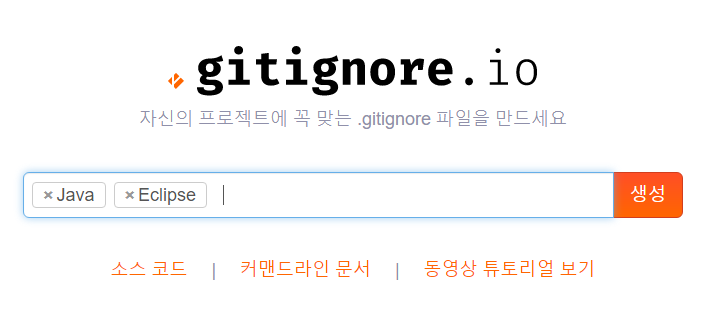
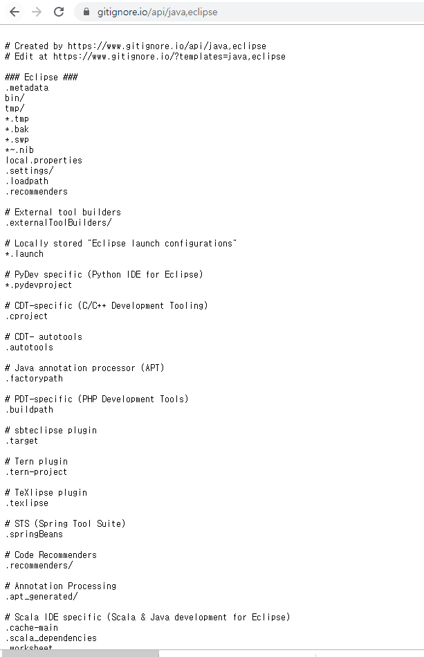

# git 기초

## (0) 준비 사항

* [git bash](https://gitforwindows.org/) 다운로드
  * git 을 활용하기 위한 Command Line Interface `( CLI )`를 제공한다.
  * source tree, github desktop등을 통해 GUI 환경에서도 활용 가능하다. 


## (1) 로컬 저장소 활용하기

### 1. 저장소 초기화

``` bash
$ git init
Initialized empty Git repository in C:/Users/student/Desktop/til/.git/
```

* 저장소(repository)를 초기화 하게 되면, `.git`폴더가 해당 디렉토리에 생성된다.
* $ git init 은 여러 프로젝트를 진행중일 경우 해당 폴더에 가서 명령어를  실행해서 초기화해주어야 한다.
* bash 창에서는 (master) 라고 표기된다.
  * 현재 브랜치가 master라는 것을 의미한다.


### 2. add - staging area

> git으로 관리되는 파일들은 working directory , staging area, commit 단계를 거쳐 이력에 저장된다.

```bash
$ git add a.txt			 # 파일명
$ git add images/ 		 # 폴더명
$ git add .				 # 현재 디렉토리의 모든 파일 및 폴더
```

* add 전 상태

```bash
$ git status
On branch master

No commits yet

Untracked files:
  (use "git add <file>..." to include in what will be committed)
        git.md
        image/
        markdown.md

nothing added to commit but untracked files present (use "git add" to track)

```

* add 후 상태

```bash
$ git add .
$ git status
On branch master
No commits yet

Changes to be committed:
  (use "git rm --cached <file>..." to unstage)
        new file:   git.md
        new file:   image/1.png
        new file:   image/image-20191216133253314.png
        new file:   markdown.md

```


### 3. commit

> 커밋은 코드의 이력을 남기는 과정이다. 

``` bash
$ git commit -m {message}

```

* 커밋 메시지는 항상 해당 이력에 대한 정보를 담을 수 있도록 작성하는 것이 좋다.
* 일관적인 커밋 메시지를 작성하는 습관을 들이자.

``` bash
$ git commit -m "마크다운 사용법 & git문법 정리"

*** Please tell me who you are.

Run

  git config --global user.email "you@example.com"
  git config --global user.name "Your Name"

to set your account's default identity.
Omit --global to set the identity only in this repository.

fatal: unable to auto-detect email address (got 'student@M16023.(none)')


$ git config --global user.name ParkYewon95
$ git config --global user.email angeljin53@naver.com


$ git commit -m "마크다운 사용법 & git문법 정리"
[master (root-commit) 9e3a120] 마크다운 사용법 & git문법 정리
 4 files changed, 158 insertions(+)
 create mode 100644 git.md
 create mode 100644 image/1.png
 create mode 100644 image/image-20191216133253314.png
 create mode 100644 markdown.md

```


### Status

* 항상 status 명령어를 통해 git의 상태를 확인하자! commit 이후에는 log 명령어를 통해 이력들을 확인하자!
* 이력 확인을 위해서 아래의 명령어를 활용한다.

``` bash
$ git status
On branch master
nothing to commit, working tree clean
```


### Log

* log 로 commit한 이력을 확인할 수 있다.

``` bash
$ git log
commit 9e3a1203317e087ca6743111ee70c25852615859 (HEAD -> master)
Author: ParkYewon95 <angeljin53@naver.com>
Date:   Mon Dec 16 14:28:11 2019 +0900

    마크다운 사용법 & git문법 정리
```


## (2) 원격 저장소 활용하기

> 원격 저장소 (remote repository)를 제공하는 서비스는 다양하게 존재한다. github을 기준으로 설명한다.


### 0. 준비하기

​	Github에서 저장소(repository) 생성

### 1. 원격 저장소 설정

```bash
$git remote add origin {github url}
```

* {github url} 부분에는 원격 저장소 url을 작성한다. 
* 원격 저장소(remote)로 {github url}을 origin 이라는 이름으로 추가(add)하는 명령어이다.
* 원격 저장소 목록을 보기 위해서는 아래 명령어를 사용한다.

``` bash
$ git remote -v
origin  https://github.com/ParkYewon95/Git.git (fetch)
origin  https://github.com/ParkYewon95/Git.git (push)

```


### 2. Push

```bash
$ git push origin master
```

* 설정된 원격저장소(origin)으로 push!

폴더의 내용을 수정 및 삭제, 생성 등을 하게 된다면, `add, commit` 명령어를 통해서 이력을 저장하고 `push` 명령어를 통해 업로드 한다.


* 통합 경우

> git 처음 사용시 global name , email 설정이 필요하다

```bash
$ git remote add origin https://github.com/ParkYewon95/Git.git
$ git push -u origin master
(로그인 아이디/패스워드)
Enumerating objects: 7, done.
Counting objects: 100% (7/7), done.
Delta compression using up to 8 threads
Compressing objects: 100% (7/7), done.
Writing objects: 100% (7/7), 34.87 KiB | 11.62 MiB/s, done.
Total 7 (delta 0), reused 0 (delta 0)
To https://github.com/ParkYewon95/Git.git
 * [new branch]      master -> master
Branch 'master' set up to track remote branch 'master' from 'origin'.


$ git log
commit 9e3a1203317e087ca6743111ee70c25852615859 (HEAD -> master, origin/master)

```


---------------

## Git Ignor

[ GitIgnor 정형화 작업](https://www.gitignore.io/)





* 자바와 이클립스를 ignore 하기 위한 가장 일반적인 형식을 제공하는 프로그램.

* gitignore는 깃헙으로 관리하지 않을 파일을 명시해주는 파일이다.

