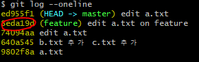

# Git status & undoing

## > commit

```bash
# WD O, staging area X
$ git commit
# commit 할 것이 없지만, -> staging area가 비어있음.
# untracked file이 있다. -> git commit 이력에 담기지 않은 파일은 있음.
nothing added to commit but untracked files present

# WD X, staging area X
$ git commit
# 어떠한 변경 사항도 없음.
nothing to commit
```

### status

1. 새로 파일 생성 한 경우

   ```bash
   $ git status
   On branch master
   
   No commits yet
   
   # commit 이력에 담긴 적 없는 파일들
   Untracked files:
   # 커밋 될 목록(staging area)에 추가하려면, git add <file>
     (use "git add <file>..." to include in what will be committed)
           a.txt
   
   nothing added to commit but untracked files present (use "git add" to track)
   ```

2. `add` 한 이후

   ```bash
   $ git add a.txt
   $ git status
   On branch master
   
   No commits yet
   # 커밋될 변경사항들(changes)
   Changes to be committed:
     (use "git rm --cached <file>..." to unstage)
           new file:   a.txt
   ```

### commit 메시지 작성하기

> 부제 : vim 활용 기초

```bash
$ git commit

# Please enter the commit message for your changes. Lines starting
# with '#' will be ignored, and an empty message aborts the commit.
#
# On branch master
#
# Initial commit
#
# Changes to be committed:
#       new file:   a.txt
#
```


- 편집(입력)모드 : `i`
  - 문서 편집 가능
- 명령 모드 : `esc`
  - `dd` : 해당 줄 삭제
  - `:wq` : 저장 및 종료
    - `w` : write
    - `q` : quit
  - `:q!` : 강제 종료
    - `q` : quit
    - `!` : 강제

```bash
$ git commit -m "commit message"
```

* 커밋 메시지는 항상 해당 작업 이력을 나타낼 수 있도록 작성한다.
* 일관적인 포맷으로 작성하려고 노력한다.


### Log

> 커밋은 해시 값(has value)에 의해서 구분된다.
>
> SHA-1 해시 알고리즘을 사용하여 표현한다.

```bash
$ git log
# 최근에 commit 한게 위에 나온다.
commit 290ec7478ae718e9a53997303046c9e43026e261 (HEAD -> master)
Author: ParkYewon95 <angeljin53@naver.com>
Date:   Wed Dec 18 10:12:46 2019 +0900

    add b.txt

# vim 이 나왔을 때 commit 메시지 작성한 것이 그대로 나온다.
commit 9802f8ab184ee7949266d6bb99126657c0f84ca4
Author: ParkYewon95 <angeljin53@naver.com>
Date:   Wed Dec 18 10:06:24 2019 +0900

    a.txt

    * a.txt추가
```

```bash
$ git log --oneline
290ec74 (HEAD -> master) add b.txt
9802f8a a.txt

# 최근 커밋 (1)개만 출력한다.숫자 변경가능.
$ git log -1 
commit 290ec7478ae718e9a53997303046c9e43026e261 (HEAD -> master)
Author: ParkYewon95 <angeljin53@naver.com>
Date:   Wed Dec 18 10:12:46 2019 +0900

    add b.txt

$ git log --oneline --graph

$ git log -1 --oneline
```


### Commit undoing

#### 1. Commit message 변경 

> --amend 옵션은 최근 commit 기록 1개만 수정할 수 있다.

```bash
$ git commit --amend
# vim 등장

$ git log --oneline
0840253 (HEAD -> master) b.txt 추가 # 메시지 변경
9802f8a a.txt
```

커밋 메시지를 수정하는 경우 해시 값이 변경되므로, 다른 이력으로 관리된다.

**따라서 공개된 저장소(원격 저장소)에 이미 push 된 경우 절대 수정해서는 안된다.**

#### 2. 특정 파일 추가하기

* c.txt 파일을 같이 Commit 하려했는데, c.txt를 add 하지 않고 커밋해 버렸을 때. 
  * push 전에 직전의 commit을 합하고 싶을 때!

```bash
$ git add c.txt
$ git commit --amend 

# vim 등장 (c.txt 추가 메시지 작성)
$ git log --oneline
640a545 (HEAD -> master) b.txt 추가 c.txt 추가
9802f8a a.txt
```


## > Staging Area

### * Add, Commit 이력이 있는 파일을 수정하는 경우.

```bash
$ git status
On branch master
Changes not staged for commit:
	# git add 로 Staging area로 보낼 수 있다.
  (use "git add <file>..." to update what will be committed)
  (use "git restore <file>..." to discard changes in working directory)
        modified:   a.txt   

$ git add a.txt
$ git status
On branch master
Changes to be committed:
	# Unstage하기 위해서 (Staging area에서 제외하기 위해서 restore 명령을 사용하라)
  (use "git restore --staged <file>..." to unstage)
        modified:   a.txt


```


#### Add 취소하기

```bash
$ git restore -- staged <file>
# ex)                                                                                              git restore --staged a.txt
```

* 구버전의 git 에서는 아래의 명령어를 사용해야 한다.

```bash
$ git reset HEAD <file>
```


#### Working Directory 변화 삭제하기 (직전으로 돌려놓기)

> git 에서는 모든 Commit 시점으로 되돌릴 수 있다.
>
> 다만,  WD 를 삭제한 것은 되돌릴 수 없다.

```bash
$ git restore <file>
# ex) git restore a.txt
# ex) git restore . (전체)
```

* 구 버전 git 에서는 아래의 명령어를 사용해야 한다.

```bash
$ git checkout -- <file>
```


## > Stash (임시저장)

> 변경사항을 임시로 저장 해놓는 공간
>
> 마지막 커밋 시점으로 되돌려준다. 

1. feature branch 에서 a.txt 변경 후 커밋
2. master branch 에서 a.txt 수정 ( add, commit 없이 )
3. merge

```bash
#3번 과정에서 에러가 난다. 
$ git merge feature
error: Your local changes to the following files would be overwritten by merge:
        a.txt
Please commit your changes or stash them before you merge.
Aborting
Updating 74094aa..8eda19d
```

### 명령어

* stash 저장

  * stash를 하게 되면 master 브랜치와 , feature 브랜치에서 수정한 부분을 모두 임시로 지운다. (충돌 날 수 있는 부분을 임시로 다 지우고 먼저 merge하게 하기 위함이다.)

  * ```
    <a.txt>
    anything else~?
    ```

```bash
$ git stash
Saved working directory and index state WIP on master: 74094aa edit a.txt
```

* stash 목록

```bash
$ git stash list
stash@{0}: WIP on master: 74094aa edit a.txt
```

* stage 불러오기

```bash
$ git stash pop # 불러오기 + 목록에서 삭제

# 혹은 아래 두줄로 작성가능하다.
$ git stash apply
$ git stash drop
```


### 해결

```bash
$ git stash # 임시 공간에 저장
$ git merge feature # 병합 
$ git stash pop # 변경사항을 임시 공간에서 불러오기

# 충돌 발생, 해결 후 작업 이어가기..!
```

```bash
# stash pop 명령어를 통해 수정해야 하는 부분을 보여준다. 
<a.txt>
anything else~?
<<<<<<< Updated upstream
수정수정				# <- feature 브랜치에서 수정
=======
aaaaaa				  # <- master 브랜치에서 수정
>>>>>>> Stashed changes
```


## > RESET vs REVERT

### Reset

> 공개된 저장소에 (원격 저장소) push 된 이력은 절대 reset 하지 않는다. 

```bash
$ git reset {해시코드}
```

* 기본 옵션 `--mixed` : 이후 변경 사항을 working directory에 유지시켜준다.
* `--hard`옵션 : 기준 커밋 이후 변경사항을 모두 삭제함. (복구할 수 없음)
* `--soft`옵션 : 지금 작업하고 있는 내용(wd) 및 변경사항을 wd에 유지시켜준다. ( 내 로컬 ) 


예시 ) 

1. 쌓여있는 커밋 중 브랜치에서 수정한 상태로 (add,commit 직전)으로 돌아간다.



```bash
$ git reset 8eda19d
Unstaged changes after reset:
M       a.txt
```

2. 상태를 확인해보면 a.txt가 수정되어있는 상태 ( add, commit이 취소된 상태로 돌아간다 )

```bash
$ git status
On branch master
Changes not staged for commit:
  (use "git add <file>..." to update what will be committed)
  (use "git restore <file>..." to discard changes in working directory)
        modified:   a.txt

no changes added to commit (use "git add" and/or "git commit -a")

$ git log --oneline
8eda19d (HEAD -> master, feature) edit a.txt on feature
74094aa edit a.txt
640a545 b.txt 추가 c.txt 추가
9802f8a a.txt
```

Cf)  `-- hard` 옵션은 a.txt파일을 아예 지워버린다.

```bash
$ git reset --hard 8eda19d
HEAD is now at 8eda19d edit a.txt on feature

# 위의 reset 후 status 와 차이가 있다.
$ git status
On branch master
nothing to commit, working tree clean
```


### Revert

> 해당 커밋으로 되돌렸다라는 이력( revert commit)을 남긴다.

``` bash
$ git revert {해시코드}
# vim 등장
```

```bash
ex) 예제 
$ git revert 8eda19d
[master 5cc631c] Revert "edit a.txt on feature"
 1 file changed, 1 deletion(-)

# reset과 다르게 commit 기록도 그대로 남고, 되돌렸다는 revert 메시지도 새로운 로그를 남긴다.
$ git log --oneline
5cc631c (HEAD -> master) Revert "edit a.txt on feature"
8eda19d (feature) edit a.txt on feature
74094aa edit a.txt
640a545 b.txt 추가 c.txt 추가
9802f8a a.txt


```

