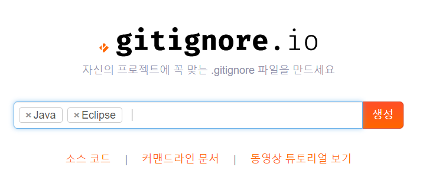
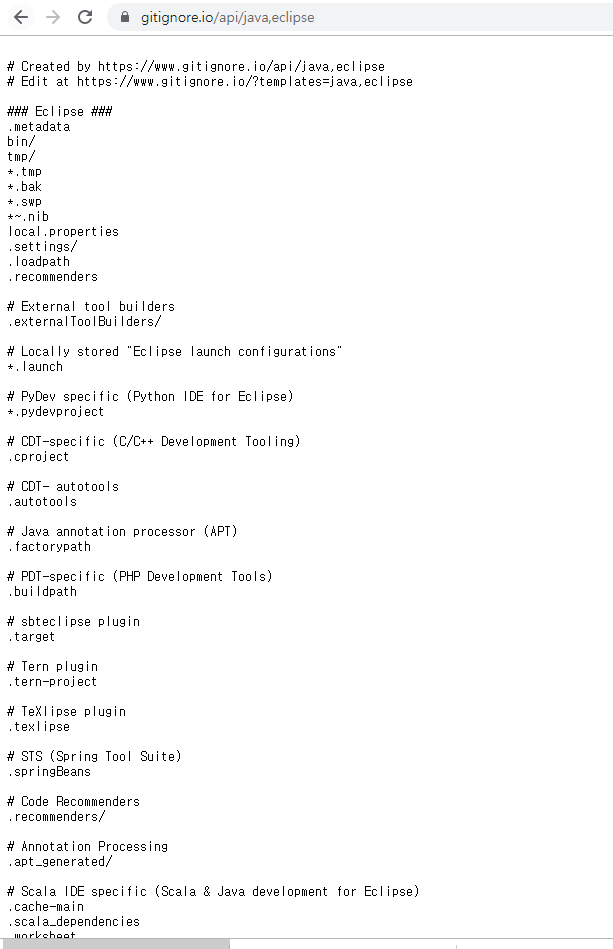
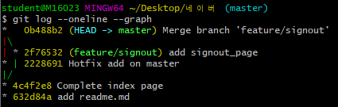
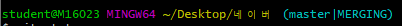
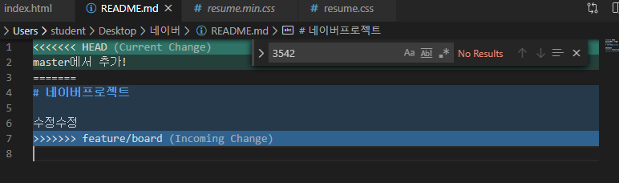

# * GIT 기초

## (0) 준비 사항

* [git bash](https://gitforwindows.org/) 다운로드
  * git 을 활용하기 위한 Command Line Interface `( CLI )`를 제공한다.
  * source tree, github desktop등을 통해 GUI 환경에서도 활용 가능하다. 


## (1) 로컬 저장소 활용하기

### 1. 저장소 초기화

``` bash
$ git init
Initialized empty Git repository in C:/Users/student/Desktop/til/.git/
```

* 저장소(repository)를 초기화 하게 되면, `.git`폴더가 해당 디렉토리에 생성된다.
* $ git init 은 여러 프로젝트를 진행중일 경우 해당 폴더에 가서 명령어를  실행해서 초기화해주어야 한다.
* bash 창에서는 (master) 라고 표기된다.
  * 현재 브랜치가 master라는 것을 의미한다.


### 2. add - staging area

> git으로 관리되는 파일들은 working directory , staging area, commit 단계를 거쳐 이력에 저장된다.

```bash
$ git add a.txt			 # 파일명
$ git add images/ 		 # 폴더명
$ git add .				 # 현재 디렉토리의 모든 파일 및 폴더
```

* add 전 상태

```bash
$ git status
On branch master

No commits yet

Untracked files:
  (use "git add <file>..." to include in what will be committed)
        git.md
        image/
        markdown.md

nothing added to commit but untracked files present (use "git add" to track)

```

* add 후 상태

```bash
$ git add .
$ git status
On branch master
No commits yet

Changes to be committed:
  (use "git rm --cached <file>..." to unstage)
        new file:   git.md
        new file:   image/1.png
        new file:   image/image-20191216133253314.png
        new file:   markdown.md

```


### 3. commit

> 커밋은 코드의 이력을 남기는 과정이다. 

``` bash
$ git commit -m {message}
```

* 커밋 메시지는 항상 해당 이력에 대한 정보를 담을 수 있도록 작성하는 것이 좋다.
* 일관적인 커밋 메시지를 작성하는 습관을 들이자.

``` bash
$ git commit -m "마크다운 사용법 & git문법 정리"

*** Please tell me who you are.

Run

  git config --global user.email "you@example.com"
  git config --global user.name "Your Name"

to set your account's default identity.
Omit --global to set the identity only in this repository.

fatal: unable to auto-detect email address (got 'student@M16023.(none)')


$ git config --global user.name ParkYewon95
$ git config --global user.email angeljin53@naver.com


$ git commit -m "마크다운 사용법 & git문법 정리"
[master (root-commit) 9e3a120] 마크다운 사용법 & git문법 정리
 4 files changed, 158 insertions(+)
 create mode 100644 git.md
 create mode 100644 image/1.png
 create mode 100644 image/image-20191216133253314.png
 create mode 100644 markdown.md

```


### Status

* 항상 status 명령어를 통해 git의 상태를 확인하자! commit 이후에는 log 명령어를 통해 이력들을 확인하자!
* 이력 확인을 위해서 아래의 명령어를 활용한다.

``` bash
$ git status
On branch master
nothing to commit, working tree clean
```


### Log

* log 로 commit한 이력을 확인할 수 있다.
* `git log --oneline` 명령어로 간략히 commit 이력을 확인할 수 있다. 

``` bash
$ git log
commit 9e3a1203317e087ca6743111ee70c25852615859 (HEAD -> master)
Author: ParkYewon95 <angeljin53@naver.com>
Date:   Mon Dec 16 14:28:11 2019 +0900

    마크다운 사용법 & git문법 정리
```


## (2) 원격 저장소 활용하기

> 원격 저장소 (remote repository)를 제공하는 서비스는 다양하게 존재한다. github을 기준으로 설명한다.


### 0. 준비하기

​	Github에서 저장소(repository) 생성

### 1. 원격 저장소 설정

```bash
$ git remote add origin {github url}
```

* {github url} 부분에는 원격 저장소 url을 작성한다. 
* 원격 저장소(remote)로 {github url}을 origin 이라는 이름으로 추가(add)하는 명령어이다.
* 원격 저장소 목록을 보기 위해서는 아래 명령어를 사용한다.

``` bash
$ git remote -v
origin  https://github.com/ParkYewon95/Git.git (fetch)
origin  https://github.com/ParkYewon95/Git.git (push)
```

* 원격 저장소 삭제

```bash
$ git remote rm origin
```


### 2. Push

```bash
$ git push origin master
```

* 설정된 원격저장소(origin)으로 push!

폴더의 내용을 수정 및 삭제, 생성 등을 하게 된다면, `add, commit` 명령어를 통해서 이력을 저장하고 `push` 명령어를 통해 업로드 한다.


* 통합 경우

> git 처음 사용시 global name , email 설정이 필요하다

```bash
$ git remote add origin https://github.com/ParkYewon95/Git.git
$ git push -u origin master
(로그인 아이디/패스워드)
Enumerating objects: 7, done.
Counting objects: 100% (7/7), done.
Delta compression using up to 8 threads
Compressing objects: 100% (7/7), done.
Writing objects: 100% (7/7), 34.87 KiB | 11.62 MiB/s, done.
Total 7 (delta 0), reused 0 (delta 0)
To https://github.com/ParkYewon95/Git.git
 * [new branch]      master -> master
Branch 'master' set up to track remote branch 'master' from 'origin'.


$ git log
commit 9e3a1203317e087ca6743111ee70c25852615859 (HEAD -> master, origin/master)

```


---------------

### Git Ignor

[ GitIgnor 정형화 작업](https://www.gitignore.io/)





* 자바와 이클립스를 ignore 하기 위한 가장 일반적인 형식을 제공하는 프로그램.

* gitignore는 깃헙으로 관리하지 않을 파일을 명시해주는 파일이다.


## (3) 원격 저장소 데려오기 - Clone/Pull

### 준비사항

* 데스크탑 1 의 git 저장소 - 멀티캠퍼스 컴퓨터 (데이터베이스 폴더)

``` bash
$ git init
$ touch a.txt
$ git add .
$ git commit -m 'Init'
```


* 데스크탑 2 에 git 저장소  - 집 컴퓨터 (database 폴더)

``` bash
# 처음에만
$ git clone {url}

# 이후 추가작업은 (.git 파일이 있는 위치에서)  
$ git pull origin master

```

* github 원격 저장소

### 시나리오

> 작업을 완료한 이후에는 항상 push.
>
> 작업을 시작하기 전에는 항상 pull.

1. 데스크탑 1 작업 시작

``` bash
$ git pull origin master
```

2. 데스크탑 1 작업

```bash
# 임의의 파일 수정/생성 등
$ git add .
$ git commit -m "message"
```

3. 데스크탑1 작업 완료

``` bash
$ git push origin master
```

4. 데스크탑 2 작업 시작

``` bash
$ git pull origin master
```

5. 데스크탑 2 작업

``` bash
# 임의의 파일 수정/생성 등
$ git add .
$ git commit -m "message"
```

6. 데스크탑2 작업완료

``` bash
$ git push origin master
```


----------------------


# * 충돌 상황 (Conflict situation)

> 만약, 원격저장소의 이력과 로컬저장소의 이력이 다를 경우 push 가 거절되면서 아래의 메시지가 발생한다.

``` bash
$ git push
To https://github.com/ParkYewon95/database.git
 ! [rejected]        master -> master (fetch first)
error: failed to push some refs to 'https://github.com/ParkYewon95/database.git'
# 원격저장소의 작업내용(work - commit)과 로컬 내용이 다르다.
hint: Updates were rejected because the remote contains work that you do
hint: not have locally. This is usually caused by another repository pushing
# 원격저장소 변경사항(changes)을 통합하고 다시 push 하라.
# 예) git pull ...
hint: to the same ref. You may want to first integrate the remote changes
hint: (e.g., 'git pull ...') before pushing again.
hint: See the 'Note about fast-forwards' in 'git push --help' for details.
```

** 이 메시지를 보게 된다면, 로컬에서 git log (--oneline) , 원격 저장소(github)의 커밋 이력들을 확인하고 다른 부분을 체크하자!

``` bash
$ git pull origin master
```

** pull 로 통합한 이후,

``` bash
$ git push origin master
```


----------------------------------------


# * GIT branch

## Branch 시나리오

### 상황 1. fast-foward

> feature 브랜치 생성된 이후 master 브랜치에 변경 사항이 없는 상황

1. feature/test branch 생성 및 이동

   ```bash
   $ git branch feature/test
   $ git checkout feature/test
   
   # 위 두줄을 요약해서 아래와 같은 명령으로 쓸 수 있다.
   $ git checkout -b feature/test
   Switched to branch 'feature/index'
   ```

2. 작업 완료 후 commit

   ```bash
   $ touch index.html
   $ git add index.html
   $ git commit -m "complete test"
   [feature/index 4c4f2e8] Complete index page
    1 files changed, 0 insertions(+), 0 deletions(-)
    create mode 100644 index.html
   ```

3. master 이동

   ```bash
   $ git checkout master
   Switched to branch 'master'
   (master) $
   ```

4. master에 병합

   ```bash
   (master) $ git merge feature/test
   ```

5. 결과 -> fast-foward (단순히 HEAD를 이동)

   ```bash
   Updating 632d84a..4c4f2e8
   Fast-forward 
    index.html | 0
    1 files changed, 0 insertions(+), 0 deletions(-)
    create mode 100644 index.html
   ```

6. branch 삭제

```bash
$ git branch -d feature/index
Deleted branch feature/index (was 4c4f2e8).
```


--------------------

### 상황 2. merge commit

> 서로 다른 이력(commit)을 병합(merge)하는 과정에서 다른 파일이 수정되어 있는 상황
>
> git이 auto merging을 진행하고, commit이 발생된다.
>
> ** 가장 일반적인 경우이다.

1. feature/signout branch 생성 및 이동

   ```bash
   $ git checkout -b feature/signout # 생성 및 이동
   Switched to a new branch 'feature/signout'
   
   # $ git branch feature/signout
   # $ git checkout feature/signout
   ```

2. 작업 완료 후 commit

   ```bash
   $ touch signout.html
   $ git add signout.html
   $ git commit -m "add signout_page"
   [feature/signout 2f76532] add signout_page
    1 file changed, 0 insertions(+), 0 deletions(-)
    create mode 100644 signout.html
   ```

3. master 이동

   ```bash
   $ git checkout master
   Switched to branch 'master'
   ```

4. master에 추가 commit 이 발생시키기!!

   *** 다른 파일을 수정 혹은 생성하세요!**

   ```bash
   $ touch hotfix.txt
   $ git add ..
   $ git commit -m "Hotfix add on master"
   ```

   ```bash
   $ git log --oneline
   2228691 (HEAD -> master) Hotfix add on master
   4c4f2e8 Complete index page
   632d84a add readme.md
   # branch feature/signout 에서 commit 한 add signout_page 이력이 없다!
   ```

5. master에 병합

   ```bash
   (master) $ git merge feature/signout
   Merge made by the 'recursive' strategy.
    signout.html | 0
    1 file changed, 0 insertions(+), 0 deletions(-)
    create mode 100644 signout.html
   ```

6. 결과 -> 자동으로 *merge commit 발생*

   - vim 편집기 화면이 나타납니다.

   - 자동으로 작성된 커밋 메시지를 확인하고, `esc`를 누른 후 `:wq`를 입력하여 저장 및 종료를 합니다.

     - `w` : write
     - `q` : quit

   - 커밋이 확인 해봅시다.

     

7. 그래프 확인하기

   ```bash
   $ git log --oneline --graph
   ```

   

8. branch 삭제

   ```bash
   $ git branch -d feature/signout
   Deleted branch feature/signout (was 4c4f2e8).
   ```

   

------

### 상황 3. merge commit 충돌

> 서로 다른 이력(commit)을 병합(merge)하는 과정에서 동일 파일이 수정되어 있는 상황
>
> git이 auto merging을 하지 못하고, 해당 파일의 위치에 <u>라벨링</u>을 해준다.
>
> 원하는 형태의 코드로 직접 수정을 하고 merge commit을 발생 시켜야 한다.

1. feature/board branch 생성 및 이동

   ```bash
   $ git checkout -b feature/board
   ```

2. 작업 완료 후 commit

   ```bash
   $ touch board.html
   # README.md 수정
   $ git add .
   $ git commit -m "add board.html"
   [feature/board 2da6c78] add board.html
    2 files changed, 3 insertions(+)
    create mode 100644 board.html
   ```

3. master 이동

   ```bash
   $ git checkout master
   Switched to branch 'master'
   ```

4. *master에 추가 commit 이 발생시키기!!*

   - **동일 파일을 수정 혹은 생성하세요!** 

   ```bash
   # README.md 수정
   $ git add .
   $ git commit -m "modify readme.md"
   [master a472903] modify readme
    1 file changed, 1 insertion(+)
   ```

   

5. master에 병합

   ```bash
   $ git merge feature/board
   Auto-merging README.md
   Auto-merging README.md
   CONFLICT (content): Merge conflict in README.md
   Automatic merge failed; fix conflicts and then commit the result.
   ```

   

6. 결과 -> *merge conflict발생*

   ```bash
   $ git status
   On branch master
   You have unmerged paths.
     (fix conflicts and run "git commit")
     (use "git merge --abort" to abort the merge)
   
   Changes to be committed:
           new file:   board.html
   
   Unmerged paths:
     (use "git add <file>..." to mark resolution)
           both modified:   README.md
   ```

   

7. 충돌 확인 및 해결

   * README.md 를 열어보면 이렇게 라벨링이 달린다.

   

   * Head(현재상황) , 아래에 feature/board 변화 내역들이 보인다.
   * 원하는 형태로 코드를 수정 후 저장합니다.

8. merge commit 진행

   ```bash
   $ git add .
   $ git commit
   ```

   - vim 편집기 화면이 나타납니다.
   - 자동으로 작성된 커밋 메시지를 확인하고, `esc`를 누른 후 `:wq`를 입력하여 저장 및 종료를 합니다.
     - `w` : write
     - `q` : quit
   - 커밋이 확인 해봅시다.

9. 그래프 확인하기

   ``` bash
   $ git log --oneline --graph
   *   54fab4d (HEAD -> master) Merge branch 'feature/board'
   |\
   | * 2da6c78 (feature/board) add board.html
   * | a472903 modify readme
   |/
   *   0b488b2 Merge branch 'feature/signout'
   |\
   | * 2f76532 (feature/signout) add signout_page
   * | 2228691 Hotfix add on master
   |/
   * 4c4f2e8 Complete index page
   * 632d84a add readme.md    
   ```

10. branch 삭제

```bash
$ git branch -d feature/board
Deleted branch feature/board (was 2da6c78).
```


---------------------------------------

# * GitHub Flow

>  shared repository Model / Fork & Pull Model 의 차이는 작업자가 저장소에 직접 push할 수 있는 권한이 있는지 없는지의 차이이다.


## 1. 저장소 공유하기 (push 권한 있음)

>  new repository - settings - collaborate - username - invite copy link 

clone - add - commit - push 

pull - add - commit - push


## 2. Fork & Pull 모델 (push권한 없음)

fork - 복제 후 내 권한으로 생성된 복제 저장소를 clone 해서 코드를 수정한 후 push까지 해서 pull request한다!

* collaborate로 초대받지 못한 저장소에 pull request를 통해 코드를 반영하게 한다.

* 오른쪽 상단 Star 옆에 Fork 를 누르면 복제. - 내 저장소에 복사된 저장소가 생긴다.
* 내 저장소에 변경된 코드를 add , commit , push 한다.
* new pull request를 선택해서 merge 요청을 한다!


-------------------


# github 호스팅 서비스 이용하기

* 무료 웹 서비스 사용 가능
  * 저장소 이름을 name.github.io 로 생성하면 된다! 
  * push후 개발

* Start bootstrap - resume  만들어져 있는 소스코드 사용 가능.

 