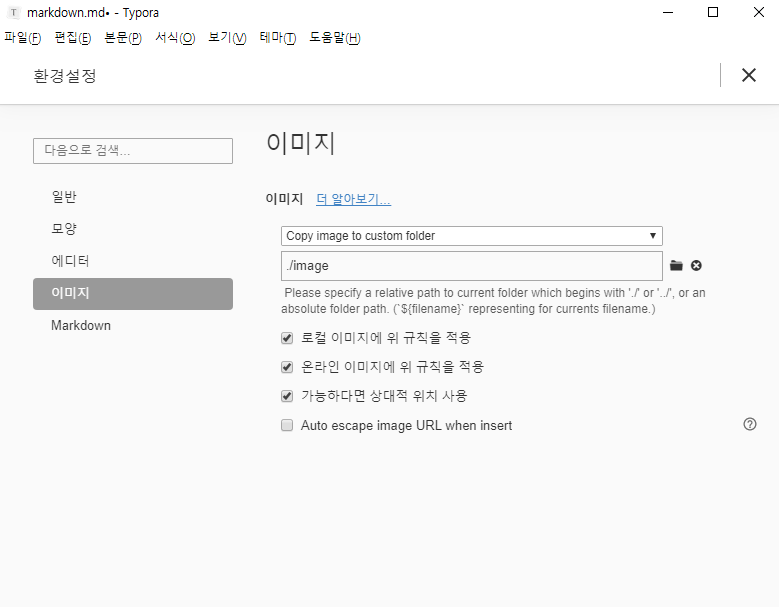

# 마크다운(markdown) 기초

## 제목 (heading) 

## 제목

`3 

제목은 `# 을 통해 표현한다

### h3

#### h4 

음영처리 `d`   ( ` 양옆에 싸기)

`*`

*  ㅇㅇ
  * ㅇㅇ

1. 순서목록
   1. ㅇㅇ
2. 네네


3. 치킨
   1. 굽네
   2. bbq
   3. bhc


# 링크

[구글신](https://google.com)

`[ 별명 ](  주소링크    )` 


## 코드블록

`  ``` java/python~ `  프로그래밍 언어 치면 코드블럭 생성

``` java
//java주석
int number = 3;
system.out.println('hi');

```

```python
# 파이선 주석
// 파이선 주석은 이게 아니다.
for i in range(10)
	print('hi')
```


> image 넣기
>
> 사진 드래그 앤 드롭 가능 


원래는 사진 넣으면 절대 경로가 잡힘. 

깃헙에 올렸을 때 후에 경로 문제로 사진이 깨질수있기 때문에 

파일 - 환경설정 에서 아래와 같이 설정해 주어 상대주소를 입력한다.




--------------------------------------------------------

### 표 삽입 가능 

본문 - 표 삽입

| 순번 | 이름   | 나이 |
| ---- | ------ | ---- |
| 1    | 최시영 | 10   |
| 2    | 김현호 | 3    |
| 3    | 심재영 | 반장 |

####  소스코드버전

```
| 순번 | 이름   | 나이 |
| ---- | ------ | ---- |
| 1    | 최시영 | 10   |
| 2    | 김현호 | 3    |
| 3    | 심재영 | 반장 |
```


### 기타

> 인용문
>
> `>` 으로 사용

----

*이탤릭체* `* 글씨 *` <- 별 하나로 싸면 기울임.

**볼드체 ** `** 글씨 ** ` <- 별 두개로 감싸면 굵게.

~~취소선~~ ` ~~ 글씨 ~~`  <- 물결 두개로 감싸면 취소선.

 